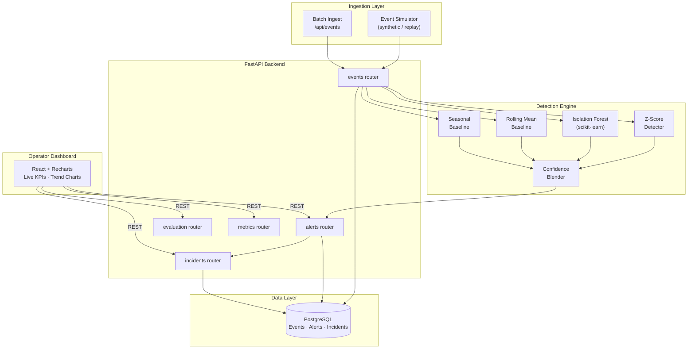

# Orbit

**Real-Time Anomaly Detection & Monitoring Platform**

[**🔗 View Live Preview →**](https://www.perplexity.ai/computer/a/orbit-preview-project-8-of-9-lCA5DWRgQoa4AN6VYPXAUQ)

> A production-style anomaly detection and monitoring platform that ingests real-time events, scores them with a blended ML pipeline, generates alerts, and exposes a live operator dashboard — built to mirror how observability tools like Datadog and New Relic work under the hood.

---

## 👋 Recruiter Summary

I'm Ryan Bush, an Information Science student at the University of Maryland (General Business minor; prior Electrical Engineering coursework). Orbit is my portfolio project showing end-to-end ownership of a real-time observability system: data modeling, streaming ingestion, blended anomaly detection (Z-score + Isolation Forest + baselines), alert/incident lifecycle, evaluation tooling, a React dashboard, Dockerized stack, and CI. It is **not deployed to production and has no real users** — every "incident" is replayed against a synthetic event stream. See [`docs/resume-bullets.md`](docs/resume-bullets.md) for ATS-friendly bullets and [`docs/observability.md`](docs/observability.md) for incident-style walkthroughs.

## 🧭 Problem Statement

Modern services emit thousands of metrics per minute. Operators need a system that (a) ingests time-series events in near real time, (b) decides which are anomalous without flooding the channel with false positives, and (c) gives a human a clean lifecycle (alert → incident → notes → resolved). Off-the-shelf tools do this, but the internals are opaque. Orbit rebuilds the core loop end-to-end so the design decisions — detector blending, suppression windows, threshold tuning — are explicit and inspectable.

---

## 🎯 What I Built & Why

Observability platforms are everywhere in production engineering, but the internals — how an event stream becomes an alert, how anomaly thresholds are tuned, how incidents are tracked — are rarely taught. I built Orbit to work through that entire lifecycle end-to-end:

- **Blended scoring** — Z-score + Isolation Forest + rolling/seasonal baselines, combined into a single confidence score. No single algorithm catches all anomaly shapes; combining them reduces both false positives and missed events.
- **Replay & evaluation tooling** — detector configuration is only as good as its evaluation. The replay engine lets you test threshold changes against historical event windows before deploying them.
- **Incident workflow** — alerts alone aren't enough. Orbit groups alerts into incidents and provides a notes/status lifecycle so analysts can track investigation state without leaving the platform.

---

## 🏗️ Architecture



---

## 📷 Features

- **Real-time event ingestion** — stream, simulate, and batch-replay security/metric events
- **Multi-detector scoring** — Z-score, Isolation Forest, rolling mean, and seasonal baselines blended into a confidence score
- **Alert & incident management** — auto-generated alerts with status workflow, analyst notes, and incident grouping
- **Evaluation tooling** — seeded benchmark runs, threshold tuning, and detector comparison endpoints
- **Live operator dashboard** — React + Recharts UI with entity trend views and KPI cards
- **Docker Compose** — one-command local stack with Postgres, backend, and frontend

---

## 🛠️ Tech Stack

| Layer | Technology |
|---|---|
| Backend API | FastAPI + SQLAlchemy + PostgreSQL |
| ML / Detection | scikit-learn (Isolation Forest), pandas (Z-score, rolling) |
| Frontend | React + Vite + Tailwind CSS + Recharts |
| Infra | Docker Compose + GitHub Actions CI |
| Linting / Testing | ruff + pytest |

---

## 🚀 Quick Start

### Prerequisites
- Docker + Docker Compose
- Python 3.11+
- Node.js 20+

### Docker (Recommended)
```bash
docker compose up --build
# Backend API docs: http://localhost:8000/docs
# Frontend:         http://localhost:5173
```

### Local Development
```bash
# Backend
pip install -e ./backend[dev]
uvicorn app.main:app --app-dir backend --reload

# Frontend
npm --prefix frontend install
npm --prefix frontend run dev
```

### Demo — Replay & Simulation
```bash
make demo-replay
python backend/scripts/run_demo.py --count 200 --seed 77 --spike-every 10
```

### Quality Checks
```bash
make lint && make test && make build
```

---

## 🔌 API Examples

A small slice of the REST surface (full reference: [`docs/api.md`](docs/api.md)).

```bash
# Ingest one event
curl -X POST http://localhost:8000/api/v1/events/ingest \
  -H 'content-type: application/json' \
  -d '{"source":"demo","event_type":"latency","signal_type":"latency","entity_id":"checkout-svc","value":920.0}'

# Replay a seeded synthetic stream with spikes every 10 events
curl -X POST http://localhost:8000/api/v1/events/replay \
  -H 'content-type: application/json' \
  -d '{"source":"demo","event_type":"latency","signal_type":"latency","entity_id":"checkout-svc","count":200,"seed":77,"inject_spike_every":10}'

# KPI summary (latency / error-rate / throughput / anomaly-rate)
curl http://localhost:8000/api/v1/metrics/summary

# Top recent anomalous events
curl 'http://localhost:8000/api/v1/events/scored?limit=10&anomalous_only=true'

# Tune the detection threshold against a seeded benchmark
curl -X POST http://localhost:8000/api/v1/evaluation/threshold-tuning \
  -H 'content-type: application/json' \
  -d '{"thresholds":[0.6,0.7,0.75,0.8,0.85,0.9]}'
```

## 🧪 Sample Data

This project does not ship a static CSV — by design, all sample data is generated
deterministically by the replay engine (`POST /api/v1/events/replay`, or the
`backend/scripts/run_demo.py` helper). Same seed → same event stream → reproducible
detector evaluation. See [`docs/observability.md`](docs/observability.md) for three
worked incident-style scenarios you can replay locally.

## 🔬 Testing

```bash
cd backend
pip install -e ".[dev]"
pytest -q          # 41 tests covering ingestion, scoring, alerts, evaluation, API contracts
ruff check .       # lint
```

CI runs the same checks plus a frontend production build on every push
(`.github/workflows/ci.yml`).

## 🖼️ Screenshots / Demo

> Placeholder — screenshots of the operator dashboard (KPI cards, entity trend chart,
> alerts table, incident drawer) should be added under `docs/screenshots/` and embedded
> here. A short Loom or asciinema of `python backend/scripts/run_demo.py` against a
> running stack also makes a strong recruiter-facing demo.

---

## 🗂️ Repository Structure

```
backend/    FastAPI API, SQLAlchemy models, anomaly scoring, evaluation, services, tests
  app/        application code (api routers, services, models, schemas, core)
  scripts/    run_demo.py replay helper
  tests/      pytest suites (phases 1–8 + coverage gaps + scoring + ingestion)
frontend/   React + Vite + Tailwind + Recharts operator dashboard
docs/       Architecture, API reference, demo, deployment, observability, resume bullets
.github/    CI workflow (lint + test + frontend build), issue & PR templates
```

---

## 🚧 Limitations & Future Work

Honest scope so reviewers can calibrate expectations:

- **Not deployed.** No hosted instance, no real users, no on-call paging. "Incidents" are simulated against replayed synthetic streams.
- **No real telemetry sources.** Orbit does not ingest from OpenTelemetry, Prometheus, or any production system; it works on its own event schema.
- **Silent-failure detection is partial.** Throughput-floor alerts (see `docs/observability.md`, Example 3) are *planned* — today the drop is visible on the KPI card but does not auto-emit.
- **Single-node only.** No sharding, no Kafka, no horizontal scaling story. Postgres + a single FastAPI process.
- **Auth is minimal.** A simple API-key dependency exists; there is no full RBAC / OAuth.
- **Seasonal baseline is a stub.** Real seasonality detection (e.g., weekly / daily Fourier components) is *planned*; the current implementation uses a coarse rolling-window proxy.

Reasonable next steps: OpenTelemetry ingestion adapter, throughput-floor producer, real seasonal decomposition, optional pluggable notifier (Slack/email), and per-tenant data isolation.

---

## 📝 Key Learnings

- Blended detectors (Z-score + Isolation Forest) meaningfully outperform single-algorithm approaches, especially on irregular metric shapes
- Replay/evaluation tooling is as important as the detector itself — you can't responsibly tune thresholds without testing against historical data
- Incident management (grouping + lifecycle) is the difference between a monitoring tool and a useful operations product

---

## 📄 License

MIT
