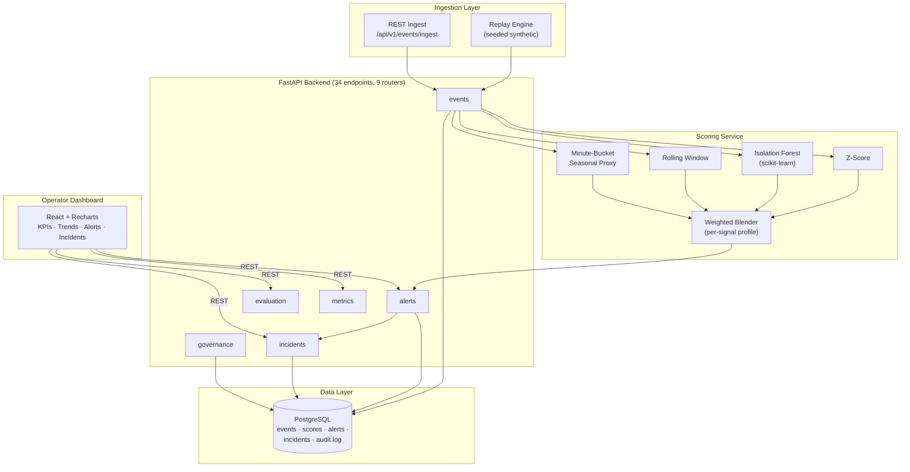
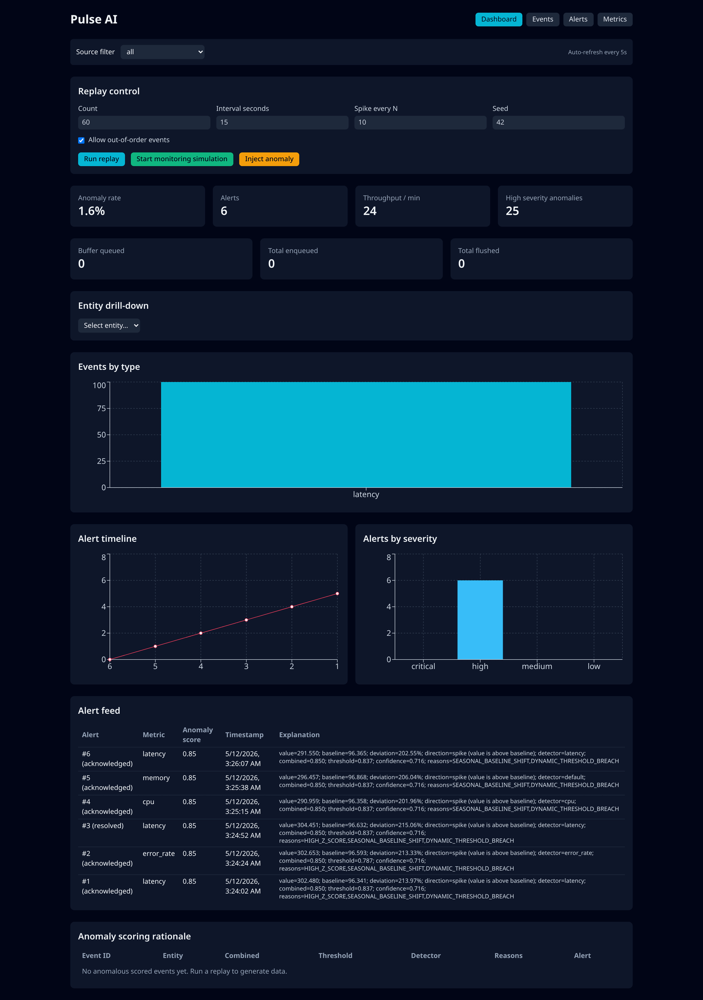
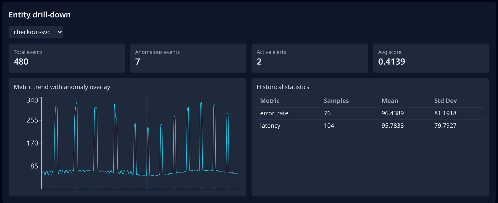
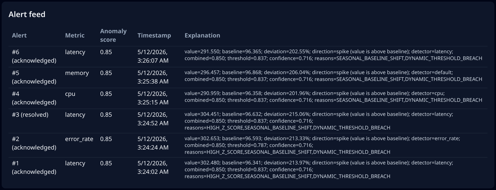
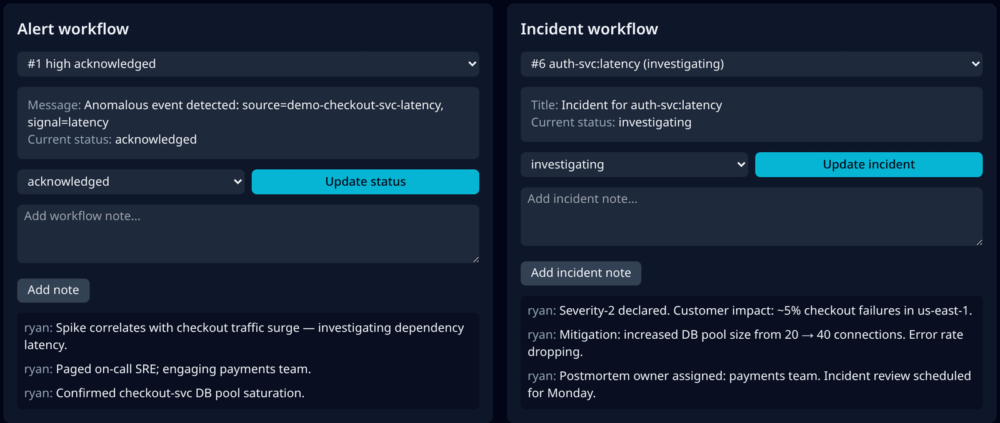
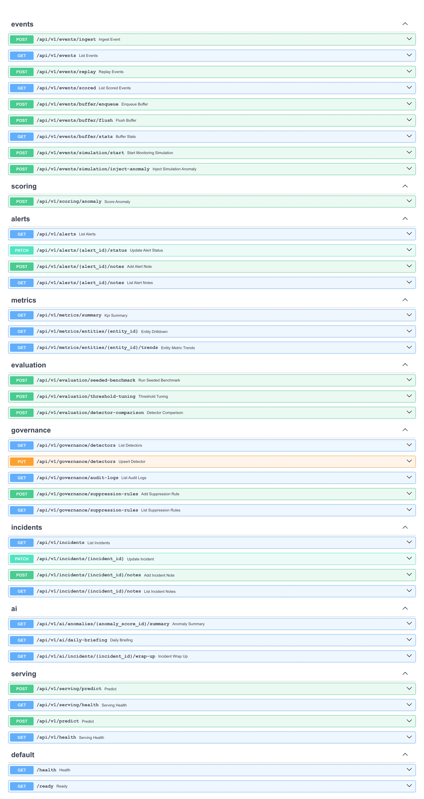

# Orbit — Real-Time Anomaly Detection and Monitoring Platform

**Local portfolio demo for SRE/observability workflows (not a production service).**

Orbit demonstrates an end-to-end anomaly operations loop on synthetic time-series data:
1) ingest events, 2) score anomalies with blended detectors, 3) create/manage alerts, and 4) track incidents with notes and audit logs.

> Scope honesty: Orbit runs locally via Docker Compose, uses synthetic replay traffic, and is intended for portfolio/interview demos. It does **not** currently implement production streaming infra, external paging integrations, full seasonal decomposition, or enterprise auth.

---

## ⚡ Recruiter Demo in 2 Minutes

For reviewers with limited time — three commands and one URL:

```bash
docker compose up --build          # 1. Boot Postgres + FastAPI + React (≈90s first run)
make demo-replay                   # 2. Replay a seeded synthetic event stream (spikes injected)
open http://localhost:4173         # 3. Watch KPIs, anomalies, alerts, and incidents update live
```

What to look at, in order:

1. **`http://localhost:4173`** — operator dashboard: KPI cards (latency / error-rate / throughput / anomaly-rate), entity trend chart, alerts table, incident drawer.
2. **`http://localhost:8000/docs`** — auto-generated OpenAPI / Swagger UI for all 34 REST endpoints.
3. **`docs/observability.md`** — three incident-style walkthroughs (latency spike, error-rate regression, throughput drop) showing how the platform *would* surface a real incident.
4. **`docs/demo-runbook.md`** — exact click/curl sequence for a 5-minute recruiter or interview demo.

> Honest scope: this is a portfolio project. It is **not** deployed to production, has no real users, and every "incident" replays a synthetic stream. See [Limitations & Future Work](#-limitations--future-work) for what's implemented vs. planned.

---

## 👋 Recruiter Summary

I'm Ryan Bush, an Information Science student at the University of Maryland (General Business minor; prior Electrical Engineering coursework). Orbit is my portfolio project showing end-to-end ownership of a real-time observability system: data modeling, event ingestion + replay, blended anomaly detection (Z-score + Isolation Forest + rolling + minute-bucket seasonal proxy), alert/incident lifecycle, evaluation tooling, a React dashboard, a Dockerized stack, and CI. It is **not deployed to production and has no real users** — every "incident" is replayed against a synthetic event stream. See [`docs/resume-bullets.md`](docs/resume-bullets.md) for ATS-friendly bullets and [`docs/observability.md`](docs/observability.md) for incident-style walkthroughs.

---

## 📊 Project / Technical Snapshot

Verified, repo-grounded facts only — count or path is cited next to each row.

| | |
|---|---|
| **Project name** | Orbit (internal package name: `pulse`) |
| **Status** | Portfolio / not deployed; no live instance, no real users |
| **Backend** | FastAPI + SQLAlchemy 2.0 (Python 3.11+) — see `backend/pyproject.toml` |
| **Database** | PostgreSQL 16 in Docker; SQLite supported for local/test (`backend/tests/conftest.py`) |
| **ML / Detection** | scikit-learn `IsolationForest` + Z-score + rolling-window + minute-bucket seasonal proxy (`backend/app/services/scoring_service.py`) |
| **Frontend** | React + Vite + Tailwind CSS + Recharts (`frontend/package.json`) |
| **REST endpoints** | 34 across 9 routers (`backend/app/api/routers/`) |
| **Domain models** | 10 SQLAlchemy models — events, anomaly scores, alerts, alert notes, incidents, incident notes, detector configs, suppression rules, audit log (`backend/app/models/`) |
| **Tests** | 40 pytest tests across 13 files (`backend/tests/`) |
| **CI** | GitHub Actions: ruff lint + pytest + frontend production build (`.github/workflows/ci.yml`) |
| **Local stack** | `docker compose up --build` → Postgres + backend on `:8000` + frontend on `:4173` |
| **Auth** | Header-based role gate (`X-Role`: admin / operator / analyst / viewer) on governance, evaluation, incidents, AI routes — `backend/app/core/auth.py`. **No** OAuth, JWT, or session auth. |
| **License** | MIT |

---

## 🎯 What This Project Demonstrates

Skills a reviewer can verify by reading the repo (not just claims):

- **End-to-end backend ownership** — REST API design, request validation (Pydantic v2 schemas), SQLAlchemy ORM, migrations-free schema bootstrap, structured logging with request IDs, in-process rate limiting, role-based route guards.
- **Applied ML / detection design** — combining Z-score, Isolation Forest, rolling baseline, and a seasonal proxy into a single 0–1 confidence score with per-signal weight profiles (`scoring_service.py`).
- **Observability product thinking** — alert lifecycle (open → acknowledged → resolved), per-source cooldown to suppress duplicate alerts, alert→incident grouping, analyst notes, audit log of state transitions.
- **Evaluation tooling** — seeded replay benchmark + threshold-tuning endpoint that emit precision / recall / FPR, plus a per-detector comparison endpoint, so detector behavior is measurable, not vibes.
- **Full-stack delivery** — React + Recharts dashboard wired to the live API, Dockerized for one-command boot, GitHub Actions CI gating ruff + pytest + frontend build.
- **Honest scoping** — the README and docs explicitly call out what's a stub or a planned next step (see [Limitations](#-limitations--future-work)).

---

## 🧭 Problem Statement

Modern services emit thousands of metrics per minute. Operators need a system that (a) ingests time-series events in near real time, (b) decides which are anomalous without flooding the channel with false positives, and (c) gives a human a clean lifecycle (alert → incident → notes → resolved). Off-the-shelf tools do this, but their internals are opaque. Orbit rebuilds the core loop end-to-end so design decisions — detector blending, suppression windows, threshold tuning — are explicit and inspectable.

---

## 🏗️ Architecture



Full prose walkthrough: [`docs/architecture.md`](docs/architecture.md).

---

## ✨ Key Technical Highlights

- **Blended scoring with per-signal weight profiles.** `scoring_service.py` picks a weight profile based on `signal_type` (latency, cpu, memory, error_rate, default) and blends four detectors into one confidence score. Profiles are also overridable per-signal via the `detector_configs` table.
- **Deterministic replay engine.** `POST /api/v1/events/replay` (and `backend/scripts/run_demo.py`) reproduces the same event stream for a given seed — so threshold tuning is repeatable instead of anecdotal.
- **Threshold tuning endpoint.** `POST /api/v1/evaluation/threshold-tuning` sweeps a list of thresholds against a seeded benchmark and returns precision / recall / FPR per threshold plus a recommended value.
- **Alert suppression + cooldown.** Per-source cooldown windows (`ALERT_COOLDOWN_SECONDS`) prevent duplicate alerts during a sustained anomaly — a standard SRE pattern.
- **Incident grouping + notes.** Alerts roll up into incidents with status transitions and analyst notes; every state change writes to an `audit_log` table.
- **Role-gated routes.** Governance, evaluation, incident, and AI summary routes require an `X-Role` header (admin / operator / analyst / viewer) via a FastAPI dependency.
- **Structured logging + request tracing.** Every HTTP request gets a generated or propagated `x-request-id`, surfaced in logs and response headers.
- **In-process rate limiting.** Per-client minute-bucket rate limit (`RATE_LIMIT_PER_MINUTE`) wired as middleware.
- **Health + readiness probes.** `/health` and `/ready` follow the standard Kubernetes contract (even though Orbit isn't deployed to a cluster).

---

## 📷 Features

- **Event ingestion + seeded replay** — REST ingest plus a deterministic replay simulator for repeatable detector evaluation.
- **Multi-detector scoring** — Z-score, Isolation Forest, rolling baseline, and a minute-bucket seasonal proxy, blended into a 0–1 confidence score.
- **Alert & incident lifecycle** — auto-generated alerts with status workflow, analyst notes, alert→incident grouping, audit log.
- **Evaluation tooling** — seeded benchmarks, threshold tuning, detector comparison endpoints.
- **Operator dashboard** — React + Recharts UI with KPI cards, entity drill-down trend charts, alerts table, and incident drawer.
- **Docker Compose** — one-command local stack: Postgres + backend + frontend.

---

## 🛠️ Tech Stack

| Layer | Technology |
|---|---|
| Backend API | FastAPI + SQLAlchemy 2.0 + PostgreSQL 16 |
| ML / Detection | scikit-learn (Isolation Forest), pure-Python statistics for Z-score / rolling / seasonal |
| Frontend | React + Vite + Tailwind CSS + Recharts |
| Infra | Docker Compose + GitHub Actions CI |
| Quality | ruff (lint+format), pytest, ESLint, Prettier |

---

## 🚀 How to Run Locally

### Prerequisites

- Docker + Docker Compose
- Python 3.11+
- Node.js 20+

### Option 1 — Docker (recommended)

```bash
docker compose up --build
# Backend API + Swagger UI:  http://localhost:8000/docs
# Frontend (compose preview): http://localhost:4173
```

### Option 2 — Local dev (hot reload)

```bash
# Backend (uvicorn with --reload)
pip install -e ./backend[dev]
uvicorn app.main:app --app-dir backend --reload
#   → http://localhost:8000/docs

# Frontend (Vite dev server)
npm --prefix frontend install
npm --prefix frontend run dev
#   → http://localhost:5173
```

Notes:
- The compose stack exposes the **Vite preview build** on `:4173`; the local `npm run dev` serves on `:5173`.
- Without a `DATABASE_URL`, the backend falls back to SQLite for quick local experimentation (see `.env.example`).

### Replay a seeded demo stream

```bash
make demo-replay
# or, with custom knobs:
python backend/scripts/run_demo.py --count 200 --seed 77 --spike-every 10
```

### Quality checks

```bash
make lint && make test && make build
# ruff + ESLint + Prettier + pytest (40 tests) + frontend production build
```

---

## 🔌 API Examples

Full reference: [`docs/api.md`](docs/api.md). Swagger UI: `http://localhost:8000/docs`.

```bash
# Ingest one event
curl -X POST http://localhost:8000/api/v1/events/ingest \
  -H 'content-type: application/json' \
  -d '{"source":"demo","event_type":"latency","signal_type":"latency","entity_id":"checkout-svc","value":920.0}'

# Replay a seeded synthetic stream with spikes every 10 events
curl -X POST http://localhost:8000/api/v1/events/replay \
  -H 'content-type: application/json' \
  -d '{"source":"demo","event_type":"latency","signal_type":"latency","entity_id":"checkout-svc","count":200,"seed":77,"inject_spike_every":10}'

# KPI summary (latency / error-rate / throughput / anomaly-rate)
curl http://localhost:8000/api/v1/metrics/summary

# Top recent anomalous events
curl 'http://localhost:8000/api/v1/events/scored?limit=10&anomalous_only=true'

# Tune the detection threshold against a seeded benchmark (requires role header)
curl -X POST http://localhost:8000/api/v1/evaluation/threshold-tuning \
  -H 'content-type: application/json' \
  -H 'x-role: analyst' \
  -d '{"thresholds":[0.6,0.7,0.75,0.8,0.85,0.9]}'
```

---

## 🧪 Sample Data

This project does not ship a static CSV — by design, all sample data is generated deterministically by the replay engine (`POST /api/v1/events/replay`, or the `backend/scripts/run_demo.py` helper). Same seed → same event stream → reproducible detector evaluation. See [`docs/observability.md`](docs/observability.md) for three worked incident-style scenarios you can replay locally.

---

## 🔬 Testing

```bash
pip install -e "./backend[dev]"
PYTHONPATH=backend pytest backend/tests -q   # 40 tests: ingestion, scoring, alerts, evaluation, API contracts
ruff check backend/app backend/tests          # lint
```

CI runs the same checks plus a frontend production build on every push (`.github/workflows/ci.yml`).

---

## 🖼️ Screenshots / Demo

All five shots were captured against the live local stack (FastAPI on `:8000`,
Vite frontend on `:4173`/`:5173`) after seeding the deterministic replay engine.
See [`docs/screenshots/README.md`](docs/screenshots/README.md) for capture details
and re-capture guidance.

### 1 · KPI dashboard


### 2 · Anomaly trend chart


### 3 · Alerts table


### 4 · Incident workflow (alert + incident notes side-by-side)


### 5 · API docs (Swagger UI)


A short Loom or asciinema of `python backend/scripts/run_demo.py` running against the live UI also makes a strong recruiter-facing artifact — see [`docs/demo-runbook.md`](docs/demo-runbook.md) for the exact sequence to record.

---

## 🗂️ Repository Structure

```
backend/    FastAPI API, SQLAlchemy models, anomaly scoring, evaluation, services, tests
  app/        application code (api routers, services, models, schemas, core)
  scripts/    run_demo.py replay helper
  tests/      pytest suites (40 tests across 13 files)
frontend/   React + Vite + Tailwind + Recharts operator dashboard
docs/       architecture, API reference, demo runbook, observability, resume bullets, screenshot guide
.github/    CI workflow (lint + test + frontend build), issue & PR templates
```

---

## 🚧 Limitations & Future Work

Honest scope so reviewers can calibrate expectations. The table below is explicit about which capabilities are *implemented* vs. *planned* — both in the README copy and in the code.

| Capability | Status | Notes |
|---|---|---|
| Production deployment / real users | ❌ Not implemented | Portfolio project only. No hosted instance, no on-call paging. |
| Real telemetry sources (OpenTelemetry, Prometheus) | ❌ Planned | Today the platform only ingests its own event schema; no OTel/Prom adapter exists. |
| Streaming transport (Kafka, NATS, Kinesis) | ❌ Not implemented | Ingestion is REST-only; no broker, no consumer group. |
| WebSocket / Server-Sent-Events push to UI | ❌ Not implemented | Frontend polls REST endpoints; there is no push channel. |
| Throughput-floor / "silent failure" alerts | ⚠️ Partial | Throughput is rendered as a KPI, but a drop does **not** auto-emit an alert. Producer is *planned* (`docs/observability.md`, Example 3). |
| Seasonal baseline | ⚠️ Proxy implemented | `scoring_service._seasonal_score` uses a minute-bucket proxy (samples sharing `timestamp.minute`); full seasonal decomposition (daily/weekly Fourier components) is *planned*. |
| Authentication | ⚠️ Header role gate only | `X-Role: admin/operator/analyst/viewer` enforced on governance, evaluation, incidents, AI routes. No OAuth, JWT, sessions, or per-tenant isolation. |
| External alerting integrations (Slack, PagerDuty, email) | ❌ Planned | No notifier code exists today; alerts surface only in-app. |
| Horizontal scaling | ❌ Not implemented | Single FastAPI process + single Postgres. No sharding, no replicas. |
| Database migrations | ❌ Not implemented | Schema is bootstrapped with `Base.metadata.create_all`; no Alembic. |
| Test coverage | ✅ 40 tests, CI-gated | Ingestion, scoring math, alert generation, evaluation, API contracts. |
| Containerized stack | ✅ Docker Compose | One-command boot of Postgres + backend + frontend. |
| CI | ✅ GitHub Actions | ruff + pytest + frontend production build on every push. |

**Reasonable next steps:** OpenTelemetry ingestion adapter, throughput-floor producer, real seasonal decomposition (Fourier or STL), Slack/email notifier with rate-limited routing, Alembic migrations, per-tenant data isolation, and a WebSocket channel so the UI doesn't have to poll.

---

## 🪪 Resume Bullets (ATS-friendly)

Pick 3–5 that match the JD. Each bullet is verifiable against this repo — no exaggerated impact claims, no fake user counts.

- Built a blended anomaly detector in Python combining Z-score, scikit-learn Isolation Forest, rolling-window, and seasonal-proxy baselines into a single 0–1 confidence score with per-signal weight profiles (`backend/app/services/scoring_service.py`).
- Designed and shipped 34 REST endpoints across 9 FastAPI routers covering event ingestion, scoring, alerts, incidents, evaluation, metrics, governance, AI summary, and model serving, documented via OpenAPI / Swagger UI.
- Modeled a 10-table normalized PostgreSQL schema in SQLAlchemy 2.0 for events, anomaly scores, alerts, alert notes, incidents, incident notes, detector configs, suppression rules, and an audit log of state transitions.
- Implemented a deterministic seeded-replay engine and a threshold-tuning endpoint that emits precision / recall / FPR per threshold, so detector behavior is empirically measurable instead of anecdotal.
- Engineered an alert lifecycle with per-source cooldown suppression, alert→incident grouping, analyst notes, and an append-only audit log — patterns directly modeled on production SRE tooling.
- Built a React + Vite + Tailwind + Recharts operator dashboard wired to the live FastAPI backend, exposing latency / error-rate / throughput / anomaly-rate KPIs plus per-entity drill-down trends.
- Containerized the stack (Postgres + FastAPI + frontend) with Docker Compose for one-command local boot, and wired GitHub Actions CI to run ruff, 40 pytest tests, and a frontend production build on every push.
- Added structured request/response logging with propagated request IDs, in-process per-client rate limiting, and Kubernetes-style `/health` + `/ready` probes — the standard observability and reliability primitives.

Longer-form variants and role-targeted tailoring tips: [`docs/resume-bullets.md`](docs/resume-bullets.md).

---

## 📍 Project Status

- **Phase:** Portfolio / showcase. Feature-complete for the lifecycle (ingest → score → alert → incident → resolve) on synthetic data.
- **Deployed?** No. No hosted instance, no real users, no on-call. Run it locally with `docker compose up --build`.
- **Actively maintained?** Yes — issues and PRs welcome; CI gates every change.
- **Roadmap:** see the [Limitations & Future Work](#-limitations--future-work) table.

---

## 📝 Key Learnings

- Blended detectors (Z-score + Isolation Forest + baselines) meaningfully outperform any single algorithm on irregular metric shapes — but only if you also build the evaluation tooling to prove it.
- Replay + threshold-tuning is as important as the detector itself; you can't responsibly ship a threshold change without testing it against a fixed seed.
- Incident management (grouping + notes + audit log) is the difference between a noisy alert firehose and a tool an operator would actually keep open.

---

## 📄 License

MIT
