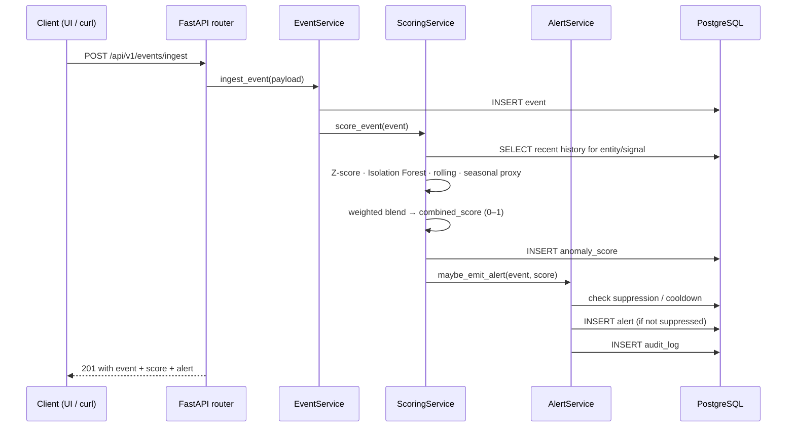

# Orbit — Architecture

> Orbit is a portfolio project (not deployed). This document describes the architecture of the
> system as implemented in this repo. Where a capability is *planned* rather than *built*, it
> is marked explicitly. The top-level [`README.md`](../README.md#-limitations--future-work)
> contains the same implemented-vs-planned table.

## Component overview

```mermaid
flowchart LR
    subgraph Client
        UI[React + Vite Dashboard]
        CURL[curl / scripts/run_demo.py]
    end

    subgraph API[FastAPI]
        MW[middleware: request-id · logging · rate-limit · CORS]
        ROUTERS[9 routers · 34 endpoints]
        AUTH[X-Role guard]
        BG[BackgroundJobRunner]
    end

    subgraph Services
        EV[EventService]
        SC[ScoringService]
        AL[AlertService]
        IN[IncidentService]
        EVAL[EvaluationService]
        MET[MetricsService]
        GOV[GovernanceService]
        AI[AISummaryService]
    end

    subgraph Data[(PostgreSQL)]
        TABLES[events · anomaly_scores · alerts ·\nalert_notes · incidents · incident_notes ·\ndetector_configs · suppression_rules · audit_log]
    end

    UI <-->|REST/JSON| MW
    CURL --> MW
    MW --> ROUTERS
    ROUTERS --> AUTH
    ROUTERS --> EV & SC & AL & IN & EVAL & MET & GOV & AI
    EV --> SC --> AL --> IN
    EV & AL & IN & GOV --> TABLES
    BG -.->|periodic| TABLES
```

## Layered responsibilities

| Layer | Code | Responsibility |
|---|---|---|
| **HTTP / middleware** | `app/main.py` | CORS, request-id propagation (`x-request-id`), structured logging, in-process per-client rate limit (`RATE_LIMIT_PER_MINUTE`), `/health` + `/ready` probes. |
| **API routers** | `app/api/routers/*.py` | 9 routers, 34 endpoints. Thin — translate Pydantic schemas to/from service calls. Role-gated routes depend on `require_role(...)`. |
| **Auth** | `app/core/auth.py` | Header role gate. `X-Role` must be one of `admin / operator / analyst / viewer`. No OAuth, JWT, sessions, or per-tenant isolation. |
| **Services** | `app/services/*.py` | Business logic for events, scoring, alerts, incidents, evaluation, metrics, governance, AI summaries, model serving. |
| **Models / schemas** | `app/models/`, `app/schemas/` | 10 SQLAlchemy 2.0 models; Pydantic v2 schemas for request/response validation. |
| **Background jobs** | `app/core/background_jobs.py` | Periodic in-process job runner (interval from `BACKGROUND_JOB_INTERVAL_SECONDS`). Started/stopped via FastAPI `lifespan`. |
| **Persistence** | `app/db/`, PostgreSQL | Schema is bootstrapped with `Base.metadata.create_all` on startup. No Alembic migrations. SQLite is supported for local/test (`backend/tests/conftest.py`). |

## Scoring pipeline (the core loop)



### Detector contributions

Implemented in `backend/app/services/scoring_service.py`:

| Detector | Method | Notes |
|---|---|---|
| Z-score | `(value − μ) / σ` over recent history for the same `(entity_id, signal_type)` | Bounded to `[0, 1]` via a divide-by-6 saturation. |
| Isolation Forest | `sklearn.ensemble.IsolationForest`, contamination `"auto"` | Run when ≥10 historical samples exist; falls back to a Z-score-derived proxy otherwise. |
| Rolling window | Mean ± k·σ band over a recent window | Distance from the band, normalized by band spread. |
| Seasonal **proxy** | Mean ± σ over samples sharing the same `timestamp.minute` bucket | **Planned upgrade:** full seasonal decomposition (daily/weekly Fourier or STL). The current minute-bucket implementation is documented as a proxy in [`README.md`](../README.md#-limitations--future-work). |

Per-signal weight profiles (latency / cpu / memory / error_rate / default) are defined in `ScoringService._detector_profiles` and overridable via the `detector_configs` table.

## Alert + incident lifecycle

- **Alert generation** — when `combined_score ≥ threshold` and the source is not in a cooldown window (`ALERT_COOLDOWN_SECONDS`), `AlertService` writes an alert with a severity bucket (`low / medium / high / critical`).
- **Suppression** — `suppression_rules` records support muting alerts by `(source, signal_type)`.
- **Lifecycle** — `PATCH /api/v1/alerts/{id}/status` walks an alert through `open → acknowledged → resolved`. Notes are appended via `POST /api/v1/alerts/{id}/notes`.
- **Incidents** — alerts can be grouped into an `incident` with its own status timeline and analyst notes (`POST /api/v1/incidents`, `POST /api/v1/incidents/{id}/notes`).
- **Audit log** — every alert/incident state transition writes an `audit_log` row with actor, action, and timestamp.

## Evaluation tooling

| Endpoint | Purpose |
|---|---|
| `POST /api/v1/evaluation/seeded-benchmark` | Replay a labeled synthetic stream and emit precision / recall / FPR. |
| `POST /api/v1/evaluation/threshold-tuning` | Sweep a list of thresholds, return per-threshold metrics + a recommended threshold. |
| `POST /api/v1/evaluation/detector-comparison` | Per-detector TPR / FPR on a slice of recent data. |

These are the levers an operator would pull to retune detection without redeploying.

## Configuration surface

All settings live in `app/core/config.py` and are read from environment variables (see `.env.example`):

| Variable | Default | Effect |
|---|---|---|
| `APP_NAME` | `Pulse AI API` | Surfaced in OpenAPI title and startup log. |
| `APP_VERSION` | `0.2.0` | Surfaced in OpenAPI. |
| `API_PREFIX` | `/api/v1` | Prefix for all REST routers. |
| `DATABASE_URL` | Compose: Postgres; local fallback: SQLite | SQLAlchemy URL. |
| `ANOMALY_THRESHOLD` | `0.75` | Default scoring → alert threshold. |
| `ALERT_COOLDOWN_SECONDS` | `300` | Per-source duplicate-alert suppression window. |
| `DEFAULT_REPLAY_COUNT` | `120` | Default events per replay call. |
| `REPLAY_SPIKE_MULTIPLIER` | `4.5` | Multiplier applied at spike injection points. |
| `CACHE_TTL_SECONDS` | `30` | TTL for the in-process metrics cache. |
| `BACKGROUND_JOB_INTERVAL_SECONDS` | `60` | Interval for the periodic background runner. |
| `RATE_LIMIT_PER_MINUTE` | `240` | Per-client cap enforced by middleware. |
| `LOG_LEVEL` | `INFO` | Root logger level. |

## Runtime topology

- **Local dev:** `uvicorn app.main:app --reload` on `:8000`; Vite dev server on `:5173`.
- **Docker Compose:** Postgres on `:5432`, FastAPI on `:8000`, frontend (Vite preview build) on `:4173`.
- **Process model:** single FastAPI process. No worker pool, no autoscaling, no clustering.

## What's deliberately *not* in the architecture

These are common observability-platform features that Orbit does **not** implement — calling them out so reviewers don't infer them from generic phrasing:

- **No streaming transport.** No Kafka, NATS, Kinesis, Pub/Sub. Ingestion is REST-only.
- **No push channel to the UI.** No WebSocket, no SSE. The frontend polls REST endpoints.
- **No external alerting integrations.** No Slack/PagerDuty/email notifier; alerts surface only in-app.
- **No OTel / Prometheus ingestion adapter.** Orbit has its own event schema and does not consume from production telemetry sources.
- **No throughput-floor / silent-failure producer.** Throughput is a visible KPI but a drop does not auto-emit an alert.
- **No production auth.** A header role gate is enforced on sensitive routes, but there is no OAuth, JWT, session store, or multi-tenant isolation.
- **No migrations.** Schema is created via `Base.metadata.create_all`; there is no Alembic.

All of the above are listed as candidate next steps in the README.
