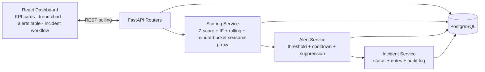

# Orbit — Architecture (Implemented vs Planned)

Orbit is a **local portfolio demo** for SRE/observability-style workflows. This document distinguishes what is implemented in this repository today vs what is planned.

## What the architecture demonstrates today

- **Dashboard and operations surface:** React UI for KPI summary, anomaly trend chart, alerts table, and incident workflow panels.
- **Data path:** REST event ingestion → scoring service → alert creation/suppression → incident lifecycle + notes + audit log.
- **Detection design:** blended scoring (Z-score + Isolation Forest + rolling baseline + minute-bucket seasonal proxy).
- **Governance/evaluation APIs:** threshold tuning, detector comparison, suppression rules, detector config overrides.

## Implemented runtime architecture

## Accuracy boundaries

### Implemented
- REST-first architecture (no message bus requirement).
- Local Docker stack: Postgres + backend + frontend.
- Alert lifecycle and incident tracking persisted in DB.
- Role gate via `X-Role` header on selected routes.

### Planned / partial
- **Streaming transport:** Kafka/NATS/Kinesis are *not* implemented.
- **External alerting integrations:** Slack/PagerDuty/email are *not* implemented.
- **Seasonality:** current baseline is a minute-bucket proxy, not full STL/Fourier decomposition.
- **Auth:** header role gate exists; full OAuth/JWT/session auth is not implemented.
- **Production observability posture:** no distributed tracing/HA/SLO-backed prod deployment.

## Frontend demonstration mapping

- **Dashboard:** demonstrates near-real-time KPI refresh from backend metrics endpoints.
- **Anomaly trend chart:** demonstrates per-entity metric trend with anomaly score overlay.
- **Alerts table:** demonstrates triage queue with status transitions and detector context.
- **Incident workflow:** demonstrates grouping/handling with notes and auditability semantics.

See also: `docs/demo-runbook.md` for demo flow and `docs/screenshots/README.md` for capture mapping.
